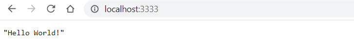

# Run your container

The easiet way to start a container is using `podman run` command. 
```
podman run -t -p 3333:3333 localhost/helloworld-python
```

Here it is in action. Note that port the application is listening on ( Port:3333)

```
PS C:\Users\aniru\workspace\github\python-podman> podman run -p 3333:3333 localhost/hellowrold-python
Trying to pull localhost/hellowrold-python:latest...
Error: initializing source docker://localhost/hellowrold-python:latest: pinging container registry localhost: Get "https://localhost/v2/": dial tcp 127.0.0.1:443: connect: connection refused
PS C:\Users\aniru\workspace\github\python-podman> podman run -p 3333:3333 localhost/helloworld-python
 * Serving Flask app 'helloworld'
 * Debug mode: off
WARNING: This is a development server. Do not use it in a production deployment. Use a production WSGI server instead.
 * Running on all addresses (0.0.0.0)
 * Running on http://127.0.0.1:3333
 * Running on http://10.0.2.100:3333
Press CTRL+C to quit
10.0.2.100 - - [06/Jan/2023 04:52:58] "GET / HTTP/1.1" 200 -
10.0.2.100 - - [06/Jan/2023 04:52:58] "GET /favicon.ico HTTP/1.1" 404 -
```

### Check the browser
Navigate to `http://127.0.0.1:3333` on your browser

### See results


### Running container in background
You can also use `podman run` command with `-d` option to run it in the background
```
PS C:\Users\aniru\workspace\github\python-podman> podman run -dt -p 3333:3333 localhost/helloworld-python
3bad5052037cbae1d3b32567faf6e945f91bfc484cf5f2a09808418ba7aa9540
```
You can check status using `podman ps` command just like `docker ps`
```
PS C:\Users\aniru\workspace\github\python-podman> podman ps
CONTAINER ID  IMAGE                               COMMAND               CREATED        STATUS            PORTS                   NAMES
3bad5052037c  localhost/helloworld-python:latest  python ./hellowor...  4 seconds ago  Up 4 seconds ago  0.0.0.0:3333->3333/tcp  zen_poitras

```

### Manage container lifecycle
Once you have the ContainerID you can manage container lifecycle using `podman start|stop|restart` commands
```
PS C:\Users\aniru\workspace\github\python-podman> podman restart 3bad5052037c
3bad5052037c
PS C:\Users\aniru\workspace\github\python-podman> podman ps
CONTAINER ID  IMAGE                               COMMAND               CREATED         STATUS            PORTS                   NAMES
3bad5052037c  localhost/helloworld-python:latest  python ./hellowor...  39 seconds ago  Up 3 seconds ago  0.0.0.0:3333->3333/tcp  zen_poitras
```
